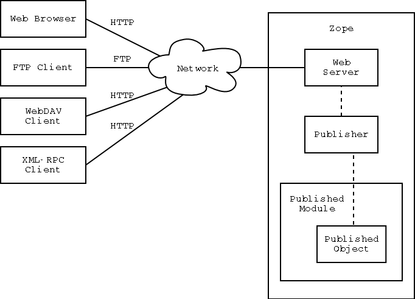
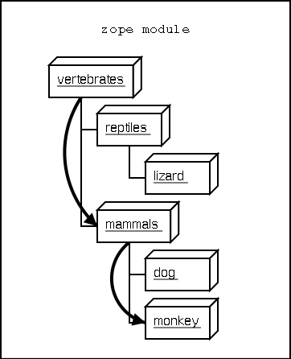

############################
オブジェクト パブリッシング
############################

..
  #################
  Object Publishing
  #################
  
  Introduction
  ============

はじめに
=========

..
  Zope puts your objects on the web. This is called *object
  publishing*. One of Zope's unique characteristics is the way it
  allows you to walk up to your objects and call methods on them with
  simple URLs.  In addition to HTTP, Zope makes your objects available
  to other network protocols including FTP, WebDAV and XML-RPC.

Zope はオブジェクトをWeb上に配置します。これは *オブジェクト
パブリッシング* と呼ばれています。 Zope のユニークな特徴として
シンプルなURLへのアクセスでオブジェクトのメソッドを呼び出したり、
オブジェクトの関連を辿ったりする仕組みがあります。
HTTP にくわえ、 FTP, WebDAV, XML-RPC などのネットワークプロトコル
で Zope はオブジェクトを扱うことが出来ます。

..
  In this chapter you'll find out exactly how Zope publishes
  objects. You'll learn all you need to know in order to design your
  objects for web publishing.

本章では、 Zope がどのようにしてオブジェクトを発行するのかを
学びます。また、 オブジェクトの Web 発行を行うために必要となる事を
学びます。

..
  HTTP Publishing
  ===============
 
HTTP パブリッシング
====================

..
  When you contact Zope with a web browser, your browser sends an HTTP
  request to Zope's web server. After the request is completely
  received, it is processed by 'ZPublisher', which is Zope's object
  publisher. 'ZPublisher' is a kind of light-weight ORB (Object Request
  Broker). It takes the request and locates an object to handle the
  request. The publisher uses the request URL as a map to locate the
  published object. Finding an object to handle the request is called
  *traversal*, since the publisher moves from object to object as it
  looks for the right one. Once the published object is found, the
  publisher calls a method on the published object, passing it
  parameters as necessary.  The publisher uses information in the
  request to determine which method to call, and what parameters to
  pass. The process of extracting parameters from the request is called
  *argument marshalling*. The published object then returns a response,
  which is passed back to Zope's web server. The web server, then
  passes the response back to your web browser.

Web ブラウザと Zope が通信するとき、ブラウザは HTTP リクエストを
Zope Web サーバーに送信します。このリクエストが正しく受信されると、
リクエストは 'ZPublisher' という Zope のオブジェクトパブリッシング
の仕組みによって処理されます。 'ZPublisher' とは軽量 ORB (オブジェクト
リクエストブローカー) の一種です。
これによってリクエストが扱うべきオブジェクトの位置が特定されます。
パブリッシャーは要求されたURLでオブジェクトの位置に照らし合わせます。
リクエストからオブジェクトを見つけ出すことを *探索(Traversal)*
と言い、パブリッシャーはオブジェクトからオブジェクトを辿って
目的のオブジェクトを見つけます。
発行対象となるオブジェクトを見つけたら、パブリッシャーは対象オブジェクト
のメソッドを呼び出し、その際に必要なパラメータを渡します。
パブリッシャーはメソッドを呼び出す際のパラメータ等の情報をリクエストから
取り出して渡します。リクエストからパラメータを取り出して分解する事を
*引数マーシャリング* と言います。
発行オブジェクトがレスポンスを返した場合、レスポンスは Zope Web サーバー
に返されます。 Web サーバーはレスポンスを呼出元の Web ブラウザーに
渡し返します。

..
  The publishing process is summarized in [2-1]
  
  .. figure:: Figures/2-1.png
  
     2.1 Object publishing

発行の手順の概要を [2-1] のようにまとめました。

   2.1 オブジェクト パブリッシング

..
  Typically the published object is a persistent object that the
  published module loads from the ZODB.  See Chapter 4 for more
  information on the ZODB.

主に、発行オブジェクトは永続オブジェクトで、発行モジュールが ZODB
からロードします。 ZODB について詳しくは4章を参照してください。

..
  This chapter will cover all the steps of object publishing in
  detail. To summarize, object publishing consists of the main steps:

本章ではオブジェクトパブリッシングの各ステップについて詳しく見て
行きます。オブジェクトパブリッシングの主要なステップを要約すると
以下のようになります。

..
  1. The client sends a request to the publisher
  
  2. The publisher locates the published object using the request
     URL as a map.
  
  3. The publisher calls the published object with arguments from
     the request.
  
  4. The publisher interprets and returns the results to the
     client.
  
  The chapter will also cover all the technical details, special cases
  and extra-steps that this list glosses over.

1. クライアントがパブリッシャーにリクエストを送る

2. パブリッシャーは発行オブジェクトの位置をURLから特定

3. パブリッシャーが発行オブジェクトをリクエスト時の引数付きで
   呼び出す

4. パブリッシャーが結果を解釈し、クライアントに結果を返送

本章では、技術の詳細、特別なケース、追加のステップなど、上記の一覧
以上の点についても触れていきます。

..
  URL Traversal
  =============

URL 探索
=========

..
  Traversal is the process the publisher uses to locate the published
  object. Typically the publisher locates the published object by
  walking along the URL. Take for example a collection of objects::

探索は、パブリッシャーが発行オブジェクトの位置を特定する
ための処理です。主に、パブリッシャーは URL に従って発行オブジェクト
を辿って位置を特定します。以下の例を見てみましょう::

      class Classification:
          ...

      class Animal:
          ...

          def screech(self, ...):
              ...

      vertebrates=Classification(...)
      vertebrates.mammals=Classification(...)
      vertebrates.reptiles=Classification(...)
      vertebrates.mammals.monkey=Animal(...)
      vertebrates.mammals.dog=Animal(...)
      vertebrates.reptiles.lizard=Animal(...)

..
  This collection of objects forms an object hierarchy. Using Zope you
  can publish objects with URLs. For example, the URL
  'http://zope/vertebrates/mammals/monkey/screech', will traverse the
  object hierarchy, find the 'monkey' object and call its 'screech'
  method.

このオブジェクトの集合はオブジェクトの階層構造を形成しています。
Zope を使って URL によるオブジェクトの発行が出来ます。例えば URL が
'http://zope/vertebrates/mammals/monkey/screech' の場合、オブジェクト
階層の探索によって 'monkey' オブジェクトを見つけ、 'screech'
メソッドを呼び出します。

..
  .. figure:: Figures/2-2.png
  
     2.2 Traversal path through an object hierarchy

   2.2 オブジェクト階層の探索

..
  The publisher starts from the root object and takes each step in the
  URL as a key to locate the next object. It moves to the next object
  and continues to move from object to object using the URL as a guide.

パブリッシャーはルートオブジェクトを起点として、 URL をキーとして
オブジェクトを次々と辿っていきます。

..
  Typically the next object is a sub-object of the current object that
  is named by the path segment. So in the example above, when the
  publisher gets to the 'vertebrates' object, the next path segment is
  "mammals", and this tells the publisher to look for a sub-object of
  the current object with that name. Traversal stops when Zope comes to
  the end of the URL. If the final object is found, then it is
  published, otherwise an error is returned.
  
  Now let's take a more rigorous look at traversal.

主に次のオブジェクトは現在のオブジェクトのサブオブジェクトで、パス名
の名前が付けられています。前述の例では、パブリッシャーは 'vertebrates'
オブジェクトを取得し、次のパス名が "mammals" なので、パブリッシャーは
この名前のサブオブジェクトが現在のオブジェクトに無いかを探します。
探索のステップはURLの末端まで辿ったところで終わりになります。
最終的なオブジェクトが見つかればそのオブジェクトが発行されます。
見つからなければエラーが返されます。

それでは、もっと厳密に探索を見ていきましょう。

..
  Traversal Interfaces
  ====================

探索インターフェース
=====================

..
  Zope defines interfaces for publishable objects, and publishable
  modules.
  
  When you are developing for Zope you almost always use the 'Zope'
  package as your published module. However, if you are using
  'ZPublisher' outside of Zope you'll be interested in the published
  module interface.
  
Zope は発行可能なオブジェクトとモジュールという意味を持つインターフェース
を定義しています。

Zopeのための開発をしているとき、たいていの場合において 'Zope' パッケージ
を発行モジュールに使用するでしょう。もし 'ZPublisher' をZope 以外で
使おうとするときには、発行モジュールのインターフェースに興味をもつ
と思います。

..
  Publishable Object Requirements
  ===============================

発行可能なオブジェクトの要件
============================

..
  Zope has few restrictions on publishable objects. The basic rule is
  that the object must have a doc string. This requirement goes for
  method objects too.

Zope は発行可能なオブジェクトについて2,3の制限を持っています。
基本ルールとして、そのオブジェクトには doc string が必須です。
このはメソッドオブジェクトであっても同様です。

..
  Another requirement is that a publishable object must not have a name
  that begin with an underscore. These two restrictions are designed to
  keep private objects from being published.

他の要件として、発行可能なオブジェクトの名前はアンダースコアで
始まっていてはいけません。これらの2つの制限は、発行においてオブジェクト
のプライベート状態を維持するための方式です。

..
  Finally, published objects cannot be Python module objects.

最後に、発行オブジェクトはPythonモジュールオブジェクトにはなれません。

..
  Traversal Methods
  =================

探索メソッド
============

..
  During traversal, 'ZPublisher' cuts the URL into path elements
  delimited by slashes, and uses each path element to traverse from the
  current object to the next object. 'ZPublisher' locates the next
  object in one of three ways:
  
  1. Using '__bobo_traverse__'
  
  2. Using 'getattr'
  
  3. Using dictionary access.

探索を行うとき、 'ZPublisher' はURLをスラッシュで分割して、パスエレメント
という単位で現在のオブジェクトから次のオブジェクトへと探索していきます。
'ZPublisher' は次のオブジェクトを見つける方法として以下の3つの方法を
使います:

1. '__bobo_traverse__' を使う

2. 'getattr' を使う

3. 辞書アクセスを使う

..
  First the publisher attempts to call the traversal hook method,
  '__bobo_traverse__'. If the current object has this method it is
  called with the request and the current path element. The method
  should return the next object or 'None' to indicate that a next
  object can't be found. You can also return a tuple of objects from
  '__bobo_traverse__' indicating a sequence of sub-objects. This allows
  you to add additional parent objects into the request. This is almost
  never necessary.

最初に、パブリッシャーは '__bobo_traverse__' という探索のための
フックメソッド呼び出しを試みます。もし現在のオブジェクトがこのメソッド
を持っていれば、 request と現在のパスエレメントを引数として呼び出します。
メソッドは次のオブジェクトを返すか、次のオブジェクトが見つからない事を
表す 'None' を返します。 '__bobo_traverse__' は次のオブジェクトとして
複数のオブジェクトをタプル型で返すことも出来ます。これによって、
request 内に追加の親オブジェクトを設定することが出来ますが、たいていの場合
において追加の親を設定する必要はありません。

..
  Here's an example of how to use '__bobo_traverse__'::
  
            def __bobo_traverse__(self, request, key):
                # if there is a special cookie set, return special
                # subobjects, otherwise return normal subobjects
  
                if request.cookies.has_key('special'):
                    # return a subobject from the special dict
                    return self.special_subobjects.get(key, None)
  
                # otherwise return a subobject from the normal dict
                return self.normal_subobjects.get(key, None)

以下の例は '__bobo_traverse__' を使う例です::

    def __bobo_traverse__(self, request, key):
        # もしここで特別なcookie値があれば、それに見合ったオブジェクト
        # を返しますが、そうでない場合は通常のオブジェクトを返します。

        if request.cookies.has_key('special'):
            # 特別な辞書からオブジェクトを返します
            return self.special_subobjects.get(key, None)

        # そうでなければ、通常の辞書からオブジェクトを返します
        return self.normal_subobjects.get(key, None)

..
  This example shows how you can examine the request during the
  traversal process.
  
この例は、探索処理中に request の内容によって処理を変えられることを
表しています。

..
  If the current object does not define a '__bobo_traverse__'
  method, then the next object is searched for using 'getattr'.
  This locates sub-objects in the normal Python sense.

もし、現在のオブジェクトが '__bobo_traverse__' メソッドを定義して
いなければ、次の方法として 'getattr' で次のオブジェクトを探します。
オブジェクトの属性を辿るのは普通に Python 的です。

..
  If the next object can't be found with 'getattr', 'ZPublisher'
  calls on the current object as though it were a
  dictionary. Note: the path element will be a string, not an
  integer, so you cannot traverse sequences using index numbers
  in the URL.

もし次のオブジェクトが 'getattr' で見つからなかった場合、 'ZPublisher'
は現在のオブジェクトに辞書アクセスを試みます。注意: パスエレメントは
数字ではなく文字列なので、 URL 中に数字を使用しても配列へのアクセスには
なりません。

..
  For example, suppose 'a' is the current object, and 'next' is
  the name of the path element. Here are the three things that
  'ZPublisher' will try in order to find the next object:

例えば現在のオブジェクトが 'a' だとして、次のパスエレメントが 'next' 
だとします。ここで 'ZPublisher' は以下の3つの方法で次のオブジェクト
を見つけようとします:

  1. 'a.__bobo_traverse__("next")'

  2. 'a.next'

  3. 'a["next"]'

..
  Publishing Methods        
  ==================

パブリッシング メソッド
========================

..
  Once the published object is located with traversal, Zope *publishes*
  it in one of three possible ways.

探索によって発行可能なオブジェクトが特定されると、 Zope は以下の3つの
方法から可能な方法でオブジェクトを発行します。

..
  - Calling the published object -- If the published object is a
    function or method or other callable object, the publisher calls
    it. Later in the chapter you'll find out how the publisher figures
    out what arguments to pass when calling.
  
- 発行可能なオブジェクトの呼び出し -- もし、発行可能なオブジェクトが
  関数・メソッド・呼び出し可能オブジェクト、の何れかであれば、パブリッシャー
  は呼び出しを行います。この章の後の方で、パブリッシャーが呼び出し時に
  引数をどのようにして渡すかを説明します。

..
  - Calling the default method -- If the published object is not
    callable, the publisher uses the default method. For HTTP 'GET' and
    'POST' requests the default method is 'index_html'. For other HTTP
    requests such as 'PUT' the publisher looks for a method named by
    the HTTP method. So for an HTTP 'HEAD' request, the publisher would
    call the 'HEAD' method on the published object.
  
- デフォルトメソッドの呼び出し -- もし発行可能なオブジェクトが呼び出し
  可能ではない場合、パブリッシャーはデフォルトメソッドを呼び出します。
  HTTP の 'GET' と 'POST' の request の場合、デフォルトメソッドは
  'index_html' です。他の HTTP request 、例えば 'PUT' の場合などは、
  パブリッシャーはそのメソッド名のメソッドを探して呼び出し、
  'HEAD' request の場合には発行可能なオブジェクトの 'HEAD' メソッドを
  呼び出すでしょう。

..
  - Stringifying the published object -- If the published object isn't
    callable, and doesn't have a default method, the publisher
    publishes it using the Python 'str' function to turn it into a
    string.

- 発行可能なオブジェクトの文字列への変換 -- もし発行可能なオブジェクト
  が呼び出し可能でなく、デフォルトメソッドもｵmって以内場合、
  パブリッシャーは Python の 'str' 関数を使ってオブジェクトを
  文字列に変換します。

..
  After the response method has been determined and called, the
  publisher must interpret the results.

呼び出されるメソッドが確定して呼び出された後、パブリッシャーは返値
を解釈する必要があります。

..
  Character Encodings for Responses
  =================================

レスポンスの文字エンコーディング
================================

..
  If the published method returns an object of type 'string', a plain
  8-bit character string, the publisher will use it directly as the
  body of the response.

もし、発行可能なオブジェクトが 'string' 型のオブジェクトか 8-bit 文字列
を返してきた場合、パブリッシャーはこれをそのままレスポンスの本文に
使用するでしょう。

..
  Things are different if the published method returns a unicode
  string, because the publisher has to apply some character
  encoding. The published method can choose which character encoding it
  uses by setting a 'Content-Type' response header which includes a
  'charset' property (setting response headers is explained later in
  this chapter). A common choice of character encoding is UTF-8. To
  cause the publisher to send unicode results as UTF-8 you need to set
  a 'Content-Type' header with the value 'text/html; charset=UTF-8'

あるいは発行メソッドが Unicode 文字列を返してきた場合、パブリッシャー
は何らかの文字エンコーディングを適用します。発行メソッドはどの
文字エンコーディングを使用するかを 'Content-Type' レスポンスヘッダー
の 'charset' 属性で指定することが出来ます
(レスポンスヘッダーの設定方法についてはこの章の後の方で説明します)。
一般的には文字エンコーディングとして UTF-8 を選択します。
パブリッシャーが Unicode の返値を UTF-8 に変換するように指定するには、
'Content-Type' ヘッダーに 'text/html; charset=UTF-8' という値を
設定してください。

..
  If the 'Content-Type' header does not include a charser property (or
  if this header has not been set by the published method) then the
  publisher will choose a default character encoding. Today this
  default is ISO-8859-1 (also known as Latin-1) for compatability with
  old versions of Zope which did not include Unicode support. At some
  time in the future this default is likely to change to UTF-8.

もし 'Content-Type' ヘッダーに charset 属性が含まれていない
(または発行メソッドでヘッダーが設定されなかった場合) には、パブリッシャー
はデフォルトの文字エンコーディングを使用します。現在のところ、この
デフォルトの文字エンコーディングは、 Unicode サポートの無い時代の古い Zope
との互換性のため ISO-8859-1 (Latin-1) となっています。
デフォルトはそのうち UTF-8 などに変更されるでしょう。

..
  HTTP Responses
  ==============

..
  Normally the published method returns a string which is considered
  the body of the HTTP response. The response headers can be controlled
  by calling methods on the response object, which is described later
  in the chapter. Optionally, the published method can return a tuple
  with the title, and body of the response. In this case, the publisher
  returns an generated HTML page, with the first item of the tuple used
  for the HTML 'title' of the page, and the second item as the contents
  of the HTML 'body' tag. For example a response of::
  
    ('response', 'the response')
  
  
  is turned into this HTML page::
  
    <html>
    <head><title>response</title></head>
    <body>the response</body>
    </html>

通常であれば、発行メソッドは HTTP レスポンスの本文となることを想定した
文字列を返します。レスポンスヘッダーはレスポンスを返すオブジェクトの
メソッド呼び出しの中で操作されます (この操作については本章の後の方で
説明します) 。他の返値として、発行メソッドはタイトルと本文となる
文字列のタプルを返すことも出来ます。この場合、パブリッシャーは HTML
ページを生成し、タプルの先頭を HTML の 'title' タグに設定し、次のタプル
アイテムを HTML の 'body' タグに設定します。
例として、以下のようなレスポンスを返すとします::

  ('response', 'the response')

これが以下の HTML ページに変換されます::

  <html>
  <head><title>response</title></head>
  <body>the response</body>
  </html>

..
  Controlling Base HREF
  =====================

ベース HREF の制御
==================

..
  When you publish an object that returns HTML relative links should
  allow you to navigate between methods. Consider this example::

オブジェクトがメソッド間を行き来できるような相対リンクを含む HTML を
返したとします。以下の例を見てください::

  class Example:
      "example"

      def one(self):
          "method one"
          return """<html>
                    <head>
                    <title>one</title>
                    </head>
                    <body>
                    <a href="two">two</a> 
                    </body>
                    </html>"""

      def two(self):
          "method two"
          return """<html>
                    <head>
                    <title>two</title>
                    </head>
                    <body>
                    <a href="one">one</a> 
                    </body>
                    </html>"""

..
  However, the default method, 'index_html' presents a problem. Since
  you can access the 'index_html' method without specifying the method
  name in the URL, relative links returned by the 'index_html' method
  won't work right. For example::

ここで、デフォルトメソッド 'index_html' が問題となります。 'index_html'
は URL に含んでいなくても呼び出されるメソッドですが、このとき 'index_html'
が相対リンクを含むページを生成した場合、この相対リンクは意図したリンクに
なりません。例えば::

            class Example:
                "example"

                 def index_html(self):
                    return """<html>
                              <head>
                              <title>one</title>
                              </head>
                              <body>
                              <a href="one">one</a> 
                              <a href="two">two</a> 
                              </body>
                              </html>"""
                 ...

..
  If you publish an instance of the 'Example' class with the URL
  'http://zope/example', then the relative link to method 'one' will be
  'http://zope/one', instead of the correct link,
  'http://zope/example/one'.

'Example' クラスのインスタンスを 'http://zope/example' という URL で発行
した場合、 'one' メソッドへの相対リンクは 'http://zope/example/one' と
なって欲しいところですが、 'http://zope/one' という意図しないリンクに
なってしまいます。

..
  Zope solves this problem for you by inserting a 'base' tag inside the
  'head' tag in the HTML output of 'index_html' method when it is
  accessed as the default method. You will probably never notice this,
  but if you see a mysterious 'base' tag in your HTML output, know you
  know where it came from. You can avoid this behavior by manually
  setting your own base with a 'base' tag in your 'index_html' method
  output.

Zope はこの問題を解決するために、 'index_html' メソッドがデフォルトメソッド
として呼び出された場合に、 'base' タグを 'head' タグ内に挿入します。
たいていの場合、このことに気づくことはないと思いますが、この不思議な
'base' タグが HTML 出力煮含まれる理由については知っておいてください。
この自動設定を行わないようにするためには、手動で 'index_html' メソッド
の出力に 'base' タグを入れておく方法があります。

..
  Response Headers
  ----------------

レスポンスヘッダー
------------------

..
  The publisher and the web server take care of setting response
  headers such as 'Content-Length' and 'Content-Type'. Later in
  the chapter you'll find out how to control these headers.
  Later you'll also find out how exceptions are used to set the
  HTTP response code.

パブリッシャーと Web サーバーは 'Content-Length' や 'Content-Type'
などのレスポンスヘッダーを設定します。本章の後の方でこれらのヘッダー
の設定方法を説明します。また、どのような例外でどんな HTTP レスポンス
コードが設定されるのかも説明します。

..
  Pre-Traversal Hook
  ------------------

探索前フック
------------

..
  The pre-traversal hook allows your objects to take special action
  before they are traversed. This is useful for doing things like
  changing the request. Applications of this include special
  authentication controls, and virtual hosting support.

探索前フックによって、探索処理が行われる前にオブジェクトに特別な操作を
行うことが出来ます。これは request の内容を変更するなどの使い方が出来ます。
このような機能の例として、認証制御や、バーチャルホスティングサポート
などがあります。

..
  If your object has a method named '__before_publishing_traverse__',
  the publisher will call it with the current object and the request,
  before traversing your object. Most often your method will change the
  request. The publisher ignores anything you return from the
  pre-traversal hook method.

もしオブジェクトに '__before_publishing_traverse__' メソッドがあれば、
パブリッシャーは探索処理の前に、このメソッドを現在のオブジェクトと
リクエストを引数として呼び出します。

..
  The 'ZPublisher.BeforeTraverse' module contains some functions that
  help you register pre-traversal callbacks. This allows you to perform
  fairly complex callbacks to multiple objects when a given object is
  about to be traversed.

'ZPublisher.BeforeTraverse' モジュールは、探索前コールバック登録のための
ヘルプ関数を多く持っています。これを使うことで、オブジェクトが探索処理
されようとしているときに、複数のオブジェクトに対する複雑なコールバックの
処理を行うことが出来るようになります。

..
  Traversal and Acquisition
  -------------------------

探索と獲得
-----------

..
  Acquisition affects traversal in several ways. See Chapter 5,
  "Acquisition" for more information on acquisition. The most obvious
  way in which acquisition affects traversal is in locating the next
  object in a path. As we discussed earlier, the next object during
  traversal is often found using 'getattr'. Since acquisition affects
  'getattr', it will affect traversal. The upshot is that when you are
  traversing objects that support implicit acquisition, you can use
  traversal to walk over acquired objects. Consider the object
  hierarchy rooted in 'fruit'::

獲得は探索にいくつかの影響を及ぼします。"獲得" については5章で詳しく
説明します。獲得が探索に及ぼす最も明確な影響は、パスから次のオブジェクト
を取り出す際に発生します。これまで説明してきたように、探索処理において
次のオブジェクトの決定にしばしば 'getattr' が使用されますが、獲得は
'getattr' に影響するため、探索にも影響することになります。結果として、
暗黙の獲得が発生すると、探索の続きが獲得されたオブジェクトで行われる
事になります。例として、オブジェクト階層のルートが 'fruit'_ である
階層構造があるとします::

        from Acquisition import Implicit

        class Node(Implicit):
            ...

        fruit=Node()
        fruit.apple=Node()
        fruit.orange=Node()
        fruit.apple.strawberry=Node()
        fruit.orange.banana=Node()

..
  When publishing these objects, acquisition can come into play. For
  example, consider the URL */fruit/apple/orange*. The publisher would
  traverse from 'fruit', to 'apple', and then using acquisition, it
  would traverse to 'orange'.

これらのオブジェクトが発行されるときに獲得機能が働きます。例えば、
URL */fruit/apple/orange* の探索処理を見てみましょう。パブリッシャー
は 'fruit', 'apple' と辿って、次に獲得機能を使って 'orange' に到達
します。

..
  Mixing acquisition and traversal can get complex. Consider the URL
  */fruit/apple/orange/strawberry/banana*. This URL is functional but
  confusing. Here's an even more perverse but legal URL
  */fruit/apple/orange/orange/apple/apple/banana*.

獲得と探索が混在する処理は複雑な結果をもたらします。 URL が
*/fruit/apple/orange/strawberry/banana* の場合、この URL はただしく
オブジェクトにたどり着きますが、なぜ正しく動作するのかすぐには理解
出来ません。さらに納得しづらいけど正しい URL の例として
*/fruit/apple/orange/orange/apple/apple/banana* などもあります。

..
  In general you should limit yourself to constructing URLs which use
  acquisition to acquire along containment, rather than context
  lines. It's reasonable to publish an object or method that you
  acquire from your container, but it's probably a bad idea to publish
  an object or method that your acquire from outside your
  container. For example::

一般的に、獲得の仕組みに沿った URL の構築を人間が行うことは、文脈
に沿った URL の構築に比べて限界があります。獲得によってオブジェクトや
メソッドを発行するのは手軽ではありますが、コンテナの外からオブジェクト
やメソッドを獲得して発行するのは、良いアイディアとは言えません。
例えば::

        from Acquisition import Implicit

        class Basket(Implicit):
            ...
            def numberOfItems(self):
                "Returns the number of contained items"
                ...

        class Vegetable(Implicit):
            ...
            def texture(self):
                "Returns the texture of the vegetable."

        class Fruit(Implicit):
            ...
            def color(self):
                "Returns the color of the fruit."

         basket=Basket()
         basket.apple=Fruit()
         basket.carrot=Vegetable()

..
  The URL */basket/apple/numberOfItems* uses acquisition along
  containment lines to publish the 'numberOfItems' method (assuming
  that 'apple' doesn't have a 'numberOfItems' attribute). However, the
  URL */basket/carrot/apple/texture* uses acquisition to locate the
  'texture' method from the 'apple' object's context, rather than from
  its container. While this distinction may be obscure, the guiding
  idea is to keep URLs as simple as possible. By keeping acquisition
  simple and along containment lines your application increases in
  clarity, and decreases in fragility.

URL */basket/apple/numberOfItems* はコンテナに沿って獲得が働き、
'numberOfItems' メソッドが発行されます ('apple' は 'numberOfItems'
属性を持っていないと言うのに！) 。また、 URL */basket/carrot/apple/texture*
も獲得が働き、コンテナからではなく 'apple' オブジェクトから 'texture'
メソッドに辿り着きます。この区別はわかりにくく、 URL は可能な限り
シンプルに保つようにするべきでしょう。獲得をシンプルに保ち、コンテナ
に沿ってのみ行われるようにすることで、アプリケーションはより明瞭になり、
脆弱性は減少します。

..
  A second usage of acquisition in traversal concerns the request. The
  publisher tries to make the request available to the published object
  via acquisition. It does this by wrapping the first object in an
  acquisition wrapper that allows it to acquire the request with the
  name 'REQUEST'. This means that you can normally acquire the request
  in the published object like so::

探索中の獲得に関するの2つめの利用例は、 request に関するものです。
パブリッシャーは発行可能なオブジェクトから request オブジェクトを
取得する際に獲得を用います。これは最初のオブジェクトが獲得ラッパー
にくるまれていて、 'REQUEST' という名前へのアクセス時に request 
オブジェクトを獲得して返す仕組みによって行われています。
つまり、通常であれば以下のようにして発行可能なオブジェクトから
request オブジェクトを取得できます::

        request=self.REQUEST # for implicit acquirers

..
  or like so::

あるいは以下のようにします::

        request=self.aq_acquire('REQUEST') # for explicit acquirers

..
  Of course, this will not work if your objects do not support
  acquisition, or if any traversed objects have an attribute named
  'REQUEST'.

もちろん、オブジェクトが獲得をサポートしていなければ、あるいは
探索したどこかのオブジェクトに 'REQUEST' 属性を見つけなければ、
この記述は機能しません。

..
  Finally, acquisition has a totally different role in object
  publishing related to security which we'll examine next.

最後に、獲得にはオブジェクトパブリッシングとは全く異なる役割があります。
次の節ではこの役割、セキュリティーついて説明します。

..
  Traversal and Security
  ----------------------

探索とセキュリティー
--------------------

..
  As the publisher moves from object to object during traversal it
  makes security checks. The current user must be authorized to access
  each object along the traversal path. The publisher controls access
  in a number of ways. For more information about Zope security, see
  Chapter 6, "Security".

パブリッシャーがオブジェクトからオブジェクトへの探索を進めているとき、
同時にセキュリティーチェックが行われます。現在のユーザーは探索パス
のうちの全てのオブジェクトについてアクセス許可されている必要があります。
パブリッシャーはいくつかの方法でアクセスを制御します。
セキュリティーについて詳しくは 6章 "セキュリティー" を参照してください。

..
  Basic Publisher Security
  ------------------------

基本的なパブリッシャーセキュリティー
------------------------------------

..
  The publisher imposes a few basic restrictions on traversable
  objects. These restrictions are the same of those for publishable
  objects. As previously stated, publishable objects must have doc
  strings and must not have names beginning with underscore.

パブリッシャーは探索可能なオブジェクトにいくつかの基本的な制限を課します。
これらの制限の内容は発行可能なオブジェクトに対してのものと同じです。
前に説明したように、発行可能なオブジェクトはかならず doc string を
持っている必要があり、名前がアンダースコアで始まっていてはいけません。

..
  The following details are not important if you are using the Zope
  framework. However, if your are publishing your own modules, the rest
  of this section will be helpful.

以下の説明は Zope フレームワークを使用している上では重要な内容では
ありません。しかしもし、あなたの独自モジュールを発行しようとしている
のであればこの節は役に立つでしょう。

..
  The publisher checks authorization by examining the '__roles__'
  attribute of each object as it performs traversal. If present, the
  '__roles__' attribute should be 'None' or a list of role names. If it
  is None, the object is considered public. Otherwise the access to the
  object requires validation.

パブリッシャーはオブジェクトへのアクセス許可状態チェックを各オブジェクトの
'__roles__' 属性の確認で行います。もし '__roles__' 属性があれば、
その値は 'None' か、ロール名のリストです。もしこれが None ならば、
オブジェクトは公開 (無認証でアクセス可能) されています。
None でない場合、オブジェクトへのアクセスには確認が必要です。

..
  Some objects such as functions and methods do not support creating
  attributes (at least they didn't before Python 2). Consequently, if
  the object has no '__roles__' attribute, the publisher will look for
  an attribute on the object's parent with the name of the object
  followed by '__roles__'. For example, a function named 'getInfo'
  would store its roles in its parent's 'getInfo__roles__' attribute.

関数やメソッドなどの多くのオブジェクトは追加の属性設定に対応して
いません (すくなくとも Python 2 以前には出来ませんでした)。
したがって、オブジェクトが '__roles__' 属性を持っていない場合、
パブリッシャーはオブジェクトの親オブジェクトに、 'オブジェクト名_roles__'
という属性が無いかを探します。例えば、 'getInfo' 関数のロール情報は
親オブジェクトに 'getInfo__roles__' 属性として保持されます。

..
  If an object has a '__roles__' attribute that is not empty and not
  'None', the publisher tries to find a user database to authenticate
  the user. It searches for user databases by looking for an
  '__allow_groups__' attribute, first in the published object, then in
  the previously traversed object, and so on until a user database is
  found.

オブジェクトが '__roles__' 属性をもっているて、それが 'None' でなく、
空でもない場合、パブリッシャーはユーザーデータベースを調べて
認証しようと試みます。ユーザーデータベースの検索は '__allow_groups__'
属性を取得するために行われ、まず発行可能なオブジェクトから始めて、
次に、一つ前の探索オブジェクトを確認し、ユーザーデータベースが見つかる
まで続けられます。

..
  When a user database is found, the publisher attempts to validate the
  user against the user database. If validation fails, then the
  publisher will continue searching for user databases until the user
  can be validated or until no more user databases can be found.

ユーザーデータベースが見つかれば、パブリッシャーはユーザーが
ユーザーデータベース内にいるか確認します。もしユーザーが見つからなければ
パブリッシャーは正しいユーザーが見つかるか、ユーザーデータベースが
見つからなくなるまで検索を続けます。

..
  The user database may be an object that provides a validate
  method::

ユーザーデータベースオブジェクトは validate メソッドを提供します::

  validate(request, http_authorization, roles)

..
  where 'request' is a mapping object that contains request
  information, 'http_authorization' is the value of the HTTP
  'Authorization' header or 'None' if no authorization header was
  provided, and 'roles' is a list of user role names.

'request' はマッピングオブジェクトで、リクエスト情報を持っています。
'http_authorization' は HTTP 'Authorization' ヘッダーの値で、
ヘッダーがなければ 'None' になります。
'roles' はユーザーロール名のリストです。

..
  The validate method returns a user object if succeeds, and 'None' if
  it cannot validate the user. See Chapter 6 for more information on
  user objects. Normally, if the validate method returns 'None', the
  publisher will try to use other user databases, however, a user
  database can prevent this by raising an exception.

validate メソッドは成功すればユーザーオブジェクトを返しますが、
ユーザーが確認出来なければ 'None' を返します。ユーザーオブジェクト
については 6 章で詳しく説明します。通常、 validate メソッドが 'None'
を返した場合、パブリッシャーは他のユーザーデータベースを使おうとしますが、
ユーザーデータベースは例外を発生させてこれを中止させることができます。

..
  If validation fails, Zope will return an HTTP header that causes your
  browser to display a user name and password dialog. You can control
  the realm name used for basic authentication by providing a module
  variable named '__bobo_realm__'. Most web browsers display the realm
  name in the user name and password dialog box.

validation が失敗したとき、 Zope はブラウザーにユーザー名とパスワード
の入力を促すダイアログを表示するよう HTTP ヘッダーを設定するでしょう。
基本認証のための realm 名は '__bobo_realm__' モジュールで制御する
ことができます。多くの Web ブラウザーは realm 名をユーザー名と
パスワードを入力するダイアログボックスに表示します。

..
  If validation succeeds the publisher assigns the user object to the
  request variable, 'AUTHENTICATED_USER'. The publisher places no
  restriction on user objects.

validation が成功した場合、パブリッシャーはユーザーオブジェクトを
request の 'AUTHENTICATED_USER' 変数に割り当てます。
The publisher places no restriction on user objects.
パブリッシャーはユーザーオブジェクトの配置に制限を持っていません。

..
  Zope Security

Zope セキュリティー
-------------------

..
  When using Zope rather than publishing your own modules, the
  publisher uses acquisition to locate user folders and perform
  security checks. The upshot of this is that your published objects
  must inherit from 'Acquisition.Implicit' or
  'Acquisition.Explicit'. See Chapter 5, "Acquisition", for more
  information about these classes. Also when traversing each object
  must be returned in an acquisition context. This is done
  automatically when traversing via 'getattr', but you must wrap
  traversed objects manually when using '__getitem__' and
  '__bobo_traverse__'. For example::

独自モジュールの発行に比べ、 Zope を使っているとパブリッシャーが
獲得を使ってユーザーフォルダーを見つけ、セキュリティーチェックを
行ってくれます。これはつまり、発行可能なオブジェクトは
'Acquisition.Implicit' か 'Acquisition.Explicit' を継承している
必要があると言うことになります。これらのクラスについて詳しくは
5 章 "獲得" を参照してください。
ところで、探索の途中で返される各オブジェクトも獲得が可能となっている
必要があります。これは探索時のオブジェクト取得が 'getattr' で
行われていれば自動的に満たしますが、 '__getitem__' か
'__bobo_traverse__' でオブジェクトを返している場合には、以下の
例のように手動で行う必要があります::

          class Example(Acquisition.Explicit):
              ...

              def __bobo_traverse__(self, name, request):
                  ...
                  next_object=self._get_next_object(name)
                  return  next_object.__of__(self)      

..
  Finally, traversal security can be circumvented with the
  '__allow_access_to_unprotected_subobjects__' attribute as described
  in Chapter 6, "Security".

最後に、 '__allow_access_to_unprotected_subobjects__' 属性による
探索セキュリティーの抜け穴について 6 章 "セキュリティー" で説明します。

..
  Environment Variables
  =====================

環境変数
========

..
  You can control some facets of the publisher's operation by setting
  environment variables.

パブリッシャーの多くの挙動を環境変数設定で制御することが出来ます。

..
  - 'Z_DEBUG_MODE' -- Sets debug mode. In debug mode tracebacks are not
    hidden in error pages. Also debug mode causes 'DTMLFile' objects,
    External Methods and help topics to reload their contents from disk
    when changed. You can also set debug mode with the '-D' switch when
    starting Zope.

- 'Z_DEBUG_MODE' -- デバッグモードを設定します。デバッグモードでは、
  トレースバックがエラーページに隠れることがありません。また、
  'DTMLFile' オブジェクト、Externalメソッドオブジェクト、ヘルプトピック
  などが変更時にディスクからリロードされるようになります。
  Zope の起動時に '-D' オプションを渡してもデバッグモードで起動する
  事が出来ます。

..
  - 'Z_REALM' -- Sets the basic authorization realm. This controls the
    realm name as it appears in the web browser's username and password
    dialog. You can also set the realm with the '__bobo_realm__' module
    variable, as mentioned previously.

- 'Z_REALM' -- 基本認証の realm を設定します。 realm 名は Web ブラウザー
  のユーザー名とパスワードを入力するダイアログに表示されます。
  別の方法として '__bobo_realm__' モジュール変数に設定しておく方法も
  あります。

..
  - 'PROFILE_PUBLISHER' -- Turns on profiling and sets the name of the
    profile file. See the Python documentation for more information
    about the Python profiler.

- 'PROFILE_PUBLISHER' -- プロファイリングを有効にし、プロファイル結果
  を記録するファイル名を設定します。 Python プロファイラーについて
  詳しくは Python ドキュメント を参照してください。

..
  Many more options can be set using switches on the startup
  script. See the *Zope Administrator's Guide* for more information.

さらに多くのオプションが起動スクリプトで設定できます。
詳しくは *Zope 管理者ガイド* を参照してください。

..
  Testing
  -------

テスト
------

..
  ZPublisher comes with built-in support for testing and working with
  the Python debugger.  This topic is covered in more detail in Chapter
  7, "Testing and Debugging".

ZPublisher はテストとデバッガーの仕組みを内蔵しています。
これについては 7 章 "テストとデバッグ" で詳しく説明します。

..
  Publishable Module
  ------------------

発行可能なモジュール
--------------------

..
  If you are using the Zope framework, this section will be irrelevant
  to you. However, if you are publishing your own modules with
  'ZPublisher' read on.

本節は、 Zope フレームワークを使っている人向けではなく、独自のモジュール
を 'ZPublisher' で発行しようとしている人向けの内容です。

..
  The publisher begins the traversal process by locating an object in
  the module's global namespace that corresponds to the first element
  of the path. Alternately the first object can be located by one of
  two hooks.

パブリッシャーは探索処理において、パスの最初のエレメントについては
モジュールのグローバルな名前空間からオブジェクトを特定します。
別の方法として、最初のオブジェクトを２つのフックから決めることが
出来ます。、

..
  If the module defines a 'web_objects' or 'bobo_application' object,
  the first object is searched for in those objects. The search happens
  according to the normal rules of traversal, using
  '__bobo_traverse__', 'getattr', and '__getitem__'.

もしモジュールが 'web_objects' か 'bobo_application' オブジェクトを
定義していれば、最初のオブジェクトはこれらのオブジェクトから検索されます。
ここでの検索は、探索の通常のルールである
'__bobo_traverse__', 'getattr', '__getitem__' に従って行われます。

..
  The module can receive callbacks before and after traversal. If the
  module defines a '__bobo_before__' object, it will be called with no
  arguments before traversal. Its return value is ignored. Likewise, if
  the module defines a '__bobo_after__' object, it will be called after
  traversal with no arguments. These callbacks can be used for things
  like acquiring and releasing locks.

モジュール探索の前と後とでコールバック呼び出しを受けることが出来ます。
もしオブジェクトが '__bobo_before__' オブジェクトを定義していれば、
探索処理前に引数無しで呼び出されます。このときの返値は無視されます。
同様に、モジュールが '__bobo_after__' オブジェクトを定義していれば、
探索処理の後で引数無しで呼び出されます。これらのコールバックは
獲得やロックの解放のために使われます。

..
  Calling the Published Object
  ----------------------------

発行可能なモジュールの呼び出し
-------------------------------

..
  Now that we've covered how the publisher located the published object
  and what it does with the results of calling it, let's take a closer
  look at how the published object is called.

ここまでで、パブリッシャーがどうやって発行可能なオブジェクトを見つけ出し、
結果の値を取り出すかを学びました。次は、発行可能なオブジェクトの呼び出され方
について、もっと詳しく見ていきましょう。

..
  The publisher marshals arguments from the request and automatically
  makes them available to the published object. This allows you to
  accept parameters from web forms without having to parse the
  forms. Your objects usually don't have to do anything special to be
  called from the web. Consider this function::

パブリッシャーは引数を request から取り出し、自動的に発行可能なオブジェクト
に適用します。これによって Web フォームからのデータを自分で解析せずに
フォームのパラメータを使うことが出来ます。あなたのオブジェクトが Web から
呼び出されるとき、大抵は特別な処理をなにもする必要がありません。
以下の関数を見てみましょう::

      def greet(name):
          "誰かに挨拶をする"
          return "Hello, %s" % name

..
  You can provide the 'name' argument to this function by calling it
  with a URL like *greet?name=World*. You can also call it with a HTTP
  'POST' request which includes 'name' as a form variable.

この関数の 'name' 引数を URL から渡すには *greet?name=World* のようにします。
あるいはフォーム変数を渡すように HTTP の 'POST' リクエストに 'name' を
含めて渡す事も出来ます。

..
  In the next sections we'll take a closer look at how the publisher
  marshals arguments.

次のセクションでは、パブリッシャーがどのようにして引数を生成しているのか、
もっと詳しく見ていきましょう。

..
  Marshalling Arguments from the Request
  --------------------------------------

リクエストからの引数生成
------------------------

..
  The publisher marshals form data from GET and POST requests. Simple
  form fields are made available as Python strings. Multiple fields
  such as form check boxes and multiple selection lists become
  sequences of strings. File upload fields are represented with
  'FileUpload' objects. File upload objects behave like normal Python
  file objects and additionally have a 'filename' attribute which is
  the name of the file and a 'headers' attribute which is a dictionary
  of file upload headers.

パブリッシャーは GET や POST リクエストのデータから引数を生成します。
シンプルなフォームフィールドは Python の文字列になります。
複数の値を持つフィールド (チェックボックスと複数選択リスト) は文字列
の配列になります。ファイルアップロードフィールドは 'FileUpload'
オブジェクトに変換されます。ファイルアップロードオブジェクトは Python
の普通のファイルオブジェクトのように振る舞い、これにファイル名を
格納した 'filename' 属性と、ファイルアップロード時のヘッダー情報を
格納した'headers' 属性が追加されています。

..
  The publisher also marshals arguments from CGI environment variables
  and cookies. When locating arguments, the publisher first looks in
  CGI environment variables, then other request variables, then form
  data, and finally cookies. Once a variable is found, no further
  searching is done. So for example, if your published object expects
  to be called with a form variable named 'SERVER_URL', it will fail,
  since this argument will be marshaled from the CGI environment first,
  before the form data.

パブリッシャーはさらに CGI 環境変数や cookie からも引数を生成します。
引数を割り当てるときにパブリッシャーはまず CGI 環境変数を見て、
次に他のリクエスト変数、フォームデータ、最後に cookie を見ます。
一度変数が見つかると、そこで変数を探す処理を止めます。例えば、
発行オブジェクトが 'SERVER_URL' という名前のフォーム変数付きで
呼び出されることを期待しても、これは失敗するでしょう。
この名前の変数は CGI 環境変数の方から先に見つけてしまうので、
フォームのこの変数にはたどり着きません。

..
  The publisher provides a number of additional special variables such
  as 'URL0' which are derived from the request. These are covered in
  the 'HTTPRequest' API documentation.

パブリッシャーは 'URL0' のようないくつかの追加の特別な変数を提供します。
この値はリクエストの内容から生成されます。これらについて詳しくは
'HTTPRequest' API ドキュメントを参照してください。

..
  Argument Conversion
  -------------------

引数の変換
----------

..
  The publisher supports argument conversion. For example consider this
  function::

パブリッシャーは引数の変換をサポートしています。例えば以下の関数::

        def onethird(number):
            "returns the number divided by three"
            return number / 3.0

..
  This function cannot be called from the web because by default the
  publisher marshals arguments into strings, not numbers. This is why
  the publisher provides a number of converters. To signal an argument
  conversion you name your form variables with a colon followed by a
  type conversion code. For example, to call the above function with 66
  as the argument you can use this URL *onethird?number:int=66* The
  publisher supports many converters:

この関数は Web からは呼び出せません。なぜならここで期待しているのは
数値ですが、パブリッシャーはデフォルトでは引数を文字列として受け取る
からです。これが、パブリッシャーが多くのコンバータを提供する理由です。
引数の変換を指定するために、フォームの変数名に続けてコロンと型名を
記載してください。例えば、上記の関数に 66 という数値型の引数を
渡したいのであれば、 URL に *onethird?number:int=66* と書きます。
パブリッシャーは以下のような多くのコンバータをサポートしています:

..
  - boolean -- Converts a variable to true or false. Variables that are
    0, None, an empty string, or an empty sequence are false, all
    others are true.
  
- boolean -- 値を真か偽に変換します。変数が 0, None, 空文字列, 空配列,
  の場合に偽となり、それ以外は真となります。

..
  - int -- Converts a variable to a Python integer.
  
- int -- 値を Python の integer に変換します。

..
  - long -- Converts a variable to a Python long integer.

- long -- 値を Python の long integer に変換します。
  
..
  - float -- Converts a variable to a Python floating point number.

- float -- 値を Python の浮動小数点値に変換します。
  
..
  - string -- Converts a variable to a Python string.
  
- string -- 値を Python の文字列に変換します。

..
  - ustring -- Converts a variable to a Python unicode string.

- ustring -- 値を Python の unicode 文字列に変換します。
  
..
  - required -- Raises an exception if the variable is not present or
    is an empty string.

- required -- 変数が設定されなかったり、空文字列などの場合に例外が
  発生します。
  
..
  - ignore_empty -- Excludes a variable from the request if the
    variable is an empty string.
  
- ignore_empty -- 変数が空文字列の場合に request のフォーム変数から
  取り除きます。

..
  - date -- Converts a string to a *DateTime* object. The formats
    accepted are fairly flexible, for example '10/16/2000', '12:01:13
    pm'.

- data -- 文字列を *DateTime* オブジェクトに変換します。文字列フォーマット
  は '10/16/2000' や '12:01:13 pm' など、かなり柔軟に受け付けます。

..
  - list -- Converts a variable to a Python list of values, even if
    there is only one value.
 
- list -- 値を Python の list の要素として複数、または単一の要素値に
  変換します。

..
  - tuple -- Converts a variable to a Python tuple of values, even if
    there is only one value.

- tuple -- 値を Python の tuple の要素として複数、または単一の要素値に
  変換します。

..
  - lines -- Converts a string to a Python list of values by splitting
    the string on line breaks.
 
- lines -- 文字列を改行で分割して Python の文字列の list に変換します。

..
  - tokens -- Converts a string to a Python list of values by splitting
    the string on spaces.

- tokens -- 文字列を空白で分割して Python の文字列の list に変換します。

..
  - text -- Converts a variable to a string with normalized line
    breaks.  Different browsers on various platforms encode line
    endings differently, so this converter makes sure the line endings
    are consistent, regardless of how they were encoded by the browser.

- text -- 変数の改行コードを平準化した文字列に変換します。ブラウザ間で
  改行コードが異なっていいますが、このコンバータは改行コードを平準化し、
  プログラムがブラウザ毎の改行コードを意識しなくて済むようにします。

..
  - ulines, utokens, utext -- like lines, tokens, text, but using
    unicode strings instead of plain strings.

- ulines, utokens, utext -- lines, tokens, text の unicode 文字列版です。

..
  If the publisher cannot coerce a request variable into the type
  required by the type converter it will raise an error. This is useful
  for simple applications, but restricts your ability to tailor error
  messages. If you wish to provide your own error messages, you should
  convert arguments manually in your published objects rather than
  relying on the publisher for coercion. Another possibility is to use
  JavaScript to validate input on the client-side before it is
  submitted to the server.

パブリッシャーがリクエスト変数をコンバータで変換出来なかった場合には、
例外が発生するでしょう。これはシンプルなアプリケーションには有用ですが、
エラーメッセージを仕立てるといった気の利いた処理が制限されてしまいます。
もし独自のエラーメッセージを提供したければ、発行オブジェクト内で引数を
手動で変換するのが良いでしょう。あるいは可能性として、 JavaScript を
使ってクライアントサイドでデータを投稿する前に入力のチェックを行うという
方法も考えられます。

..
  You can combine type converters to a limited extent. For example you
  could create a list of integers like so::

型コンバータは複数並べることができます。例えばいくつかの数値で構成された
list を作るためには::

        <input type="checkbox" name="numbers:list:int" value="1">
        <input type="checkbox" name="numbers:list:int" value="2">
        <input type="checkbox" name="numbers:list:int" value="3">

これらの型コンバータに加え、パブリッシャーは method と record の引数
もサポートしています。

..
  Character Encodings for Arguments
  ---------------------------------

引数の文字エンコーディング
--------------------------

..
  The publisher needs to know what character encoding was used by the
  browser to encode form fields into the request. That depends on
  whether the form was submitted using GET or POST (which the publisher
  can work out for itself) and on the character encoding used by the
  page which contained the form (for which the publisher needs your
  help).

パブリッシャーはブラウザから送られるフォームフィールドの
文字エンコーディングが何であるかを知っておく必要があります。
これは、 GET か POST (どちらで送信されたかはパブリッシャー自身が
知っています) で送信されたフォームや、フォームを含むページの
文字エンコードが何だったか (これをパブリッシャーが知るには、
あなたの助けが必要です) に関連します。

..
  In some cases you need to add a specification of the character
  encoding to each fields type converter. The full details of how this
  works are explained below, however most users do not need to deal
  with the full details:

多くのケースでは、あなたが各フィールドの型コンバータに
文字エンコーディングを指定する必要があります。こういった指定の方法を
含め、全体的にどのように動作するのかについて、以下で説明します。
ただし、たいていの人は全ての詳細までは知る必要はないでしょう。

..
  1. If your pages all use the UTF-8 character encoding (or at least
     all the pages that contain forms) the browsers will always use
     UTF-8 for arguments. You need to add ':utf8' into all argument
     type converts. For example:
  
     <input type="text" name="name:utf8:ustring">
     <input type="checkbox" name="numbers:list:int:utf8" value="1">
     <input type="checkbox" name="numbers:list:int:utf8" value="1">
  
       % Anonymous User - Apr. 6, 2004 5:56 pm:
        121

1. もしあなたのページの文字エンコーディングが全て UTF-8
   (あるいは少なくとも全てのページがフォームを含む) なら、ブラウザは
   常に引数に UTF-8 を使うでしょう。この場合、 ':utf8' を以下の例のように
   全ての型コンバータ指定の後ろに付けてください:

   <input type="text" name="name:utf8:ustring">
   <input type="checkbox" name="numbers:list:int:utf8" value="1">
   <input type="checkbox" name="numbers:list:int:utf8" value="1">

.. [訳注]これは何？
     % Anonymous User - Apr. 6, 2004 5:56 pm:
      121

..
  2. If your pages all use a character encoding which has ASCII as a
     subset (such as Latin-1, UTF-8, etc) then you do not need to
     specify any chatacter encoding for boolean, int, long, float, and
     date types.  You can also omit the character encoding type
     converter from string, tokens, lines, and text types if you only
     need to handle ASCII characters in that form field.

2. もしあなたのページの文字エンコーディングが全て ASCII またはそのサブセット
   (Latin-1, UTF-8, など) なら、boolean, int, long, float, date 型には
   文字エンコーディングを指定する必要はありません。 string, tokens, lines, text
   型についても、 ASCII 文字コードしかフォームで扱わないのであれば、
   文字エンコーディング指定を省略することが出来ます。

..
  Character Encodings for Arguments; The Full Story
  ~~~~~~~~~~~~~~~~~~~~~~~~~~~~~~~~~~~~~~~~~~~~~~~~~

引数の文字エンコーディング; その全体像
~~~~~~~~~~~~~~~~~~~~~~~~~~~~~~~~~~~~~~
..
  If you are not in one of those two easy categories, you first need to
  determine which character encoding will be used by the browser to
  encode the arguments in submitted forms.

以下に２つの簡単な分類を作りました。あなたがどちらにも属さないのであれば、
まず、ブラウザで使用する、そしてフォームから送信する文字エンコーディングを
何にするかを決める必要があります。

..
  1. Forms submitted using GET, or using POST with 
     "application/x-www-form-urlencoded" (the default) 
  
     1. Page uses an encoding of unicode: Forms are submitted using
        UTF8, as required by RFC 2718 2.2.5
  
     2. Page uses another regional 8 bit encoding: Forms are often
        submitted using the same encoding as the page. If you choose to
        use such an encoding then you should also verify how browsers
        behave.

1. フォームの送信に GET か POST を使用しており、その際にパラメータ
   "application/x-www-form-urlencoded" (デフォルト) を付けて送っている。

   1. ページで unicode 系のエンコーディングが使われている場合、フォームは
      UFT8 で送られます。これは RFC 2718 2.2.5 で定められています。

   2. ページに 8 bit の地域固有のエンコーディングが使われている場合、
      フォームはそのページと同じエンコーディングで送信されます。
      もし、このようなエンコーディングを使用した場合、ブラウザ毎の
      挙動を確認した方が良いでしょう。

..
  2. Forms submitted using "multipart/form-data":
  
     According to HTML 4.01 (section 17.13.4) browsers should state
     which character encoding they are using for each field in a
     Content-Type header, however this is poorly supported. The current
     crop of browsers appear to use the same encoding as the page
     containing the form.
  
     Every field needs that character encoding name appended to is
     converter.  The tag parser insists that tags must only use
     alphanumberic characters or an underscore, so you might need to
     use a short form of the encoding name from the Python 'encodings'
     library package (such as utf8 rather than UTF-8).

2. フォームの送信に "multipart/form-data" を使う場合:

   HTML 4.01 (セクション 17.13.4) によると、ブラウザは各フィールドの
   文字エンコーディングとして Content-Type ヘッダーを使うことになっており、
   大抵はこのように動作します。現状、ブラウザはフォームのあるページの
   エンコーディングと同じものを使用しています。

   全てのフィールドには文字エンコーディング名をコンバータ名のうしろに
   付ける必要があります。タグパーサーは、タグがアルファベットと
   アンダースコアだけで構成される文字列を要求します。このため、
   エンコーディング名には Python の 'encodings' ライブラリにある
   短い名前を使用するのが望ましいでしょう (UTF-8 よりは utf8 を使いましょう)。

Method Arguments
----------------

Sometimes you may wish to control which object is published based on
form data. For example, you might want to have a form with a select
list that calls different methods depending on the item
chosen. Similarly, you might want to have multiple submit buttons
which invoke a different method for each button.

The publisher provides a way to select methods using form variables
through use of the *method* argument type. The method type allows the
request 'PATH_INFO' to be augmented using information from a form
item name or value.

If the name of a form field is ':method', then the value of the field
is added to 'PATH_INFO'. For example, if the original 'PATH_INFO' is
'foo/bar' and the value of a ':method' field is 'x/y', then
'PATH_INFO' is transformed to 'foo/bar/x/y'. This is useful when
presenting a select list. Method names can be placed in the select
option values.

If the name of a form field ends in ':method' then the part of the
name before ':method' is added to 'PATH_INFO'. For example, if the
original 'PATH_INFO' is 'foo/bar' and there is a 'x/y:method' field,
then 'PATH_INFO' is transformed to 'foo/bar/x/y'. In this case, the
form value is ignored. This is useful for mapping submit buttons to
methods, since submit button values are displayed and should,
therefore, not contain method names.

Only one method field should be provided. If more than one method
field is included in the request, the behavior is undefined.

Record Arguments 
----------------

Sometimes you may wish to consolidate form data into a structure
rather than pass arguments individually. Record arguments allow you
to do this.

The 'record' type converter allows you to combine multiple
form variables into a single input variable. For example::

  <input name="date.year:record:int">
  <input name="date.month:record:int">
  <input name="date.day:record:int">

This form will result in a single variable, 'date', with
attributes 'year', 'month', and 'day'.

You can skip empty record elements with the 'ignore_empty'
converter. For example::

  <input type="text" name="person.email:record:ignore_empty">

When the email form field is left blank the publisher skips over the
variable rather than returning a null string as its value. When the
record 'person' is returned it will not have an 'email' attribute if
the user did not enter one.

You can also provide default values for record elements with the
'default' converter. For example::

  <input type="hidden"
         name="pizza.toppings:record:list:default" 
         value="All">
  <select multiple name="pizza.toppings:record:list:ignore_empty">
  <option>Cheese</option>
  <option>Onions</option>
  <option>Anchovies</option>
  <option>Olives</option>
  <option>Garlic<option>
  </select>

The 'default' type allows a specified value to be inserted when the
form field is left blank. In the above example, if the user does not
select values from the list of toppings, the default value will be
used. The record 'pizza' will have the attribute 'toppings' and its
value will be the list containing the word "All" (if the field is
empty) or a list containing the selected toppings.

You can even marshal large amounts of form data into multiple records
with the 'records' type converter. Here's an example::

  <h2>Member One</h2>
  Name:
  <input type="text" name="members.name:records"> 
  Email:
  <input type="text" name="members.email:records"> 
  Age:
  <input type="text" name="members.age:int:records"> 

  <H2>Member Two</H2>
  Name:
  <input type="text" name="members.name:records"> 
  Email:
  <input type="text" name="members.email:records"> 
  Age:
  <input type="text" name="members.age:int:records"> 

This form data will be marshaled into a list of records named
'members'. Each record will have a 'name', 'email', and 'age'
attribute.

Record marshalling provides you with the ability to create complex
forms. However, it is a good idea to keep your web interfaces as
simple as possible.

Exceptions
----------

Unhandled exceptions are caught by the object publisher and are
translated automatically to nicely formatted HTTP output.

When an exception is raised, the exception type is mapped to an HTTP
code by matching the value of the exception type with a list of
standard HTTP status names. Any exception types that do not match
standard HTTP status names are mapped to "Internal Error" (500). The
standard HTTP status names are: "OK", "Created", "Accepted", "No
Content", "Multiple Choices", "Redirect", "Moved Permanently", "Moved
Temporarily", "Not Modified", "Bad Request", "Unauthorized",
"Forbidden", "Not Found", "Internal Error", "Not Implemented", "Bad
Gateway", and "Service Unavailable". Variations on these names with
different cases and without spaces are also valid.

An attempt is made to use the exception value as the body of the
returned response. The object publisher will examine the exception
value. If the value is a string that contains some white space, then
it will be used as the body of the return error message. If it
appears to be HTML, the error content type will be set to
'text/html', otherwise, it will be set to 'text/plain'. If the
exception value is not a string containing white space, then the
object publisher will generate its own error message.

There are two exceptions to the above rule:

1. If the exception type is: "Redirect", "Multiple Choices" "Moved
   Permanently", "Moved Temporarily", or "Not Modified", and the
   exception value is an absolute URI, then no body will be provided
   and a 'Location' header will be included in the output with the
   given URI.

2. If the exception type is "No Content", then no body will be
   returned.

When a body is returned, traceback information will be included in a
comment in the output. As mentioned earlier, the environment variable
'Z_DEBUG_MODE' can be used to control how tracebacks are included. If
this variable is set then tracebacks are included in 'PRE' tags,
rather than in comments. This is very handy during debugging.

Exceptions and Transactions
---------------------------

When Zope receives a request it begins a transaction. Then it begins
the process of traversal. Zope automatically commits the transaction
after the published object is found and called. So normally each web
request constitutes one transaction which Zope takes care of for
you. See Chapter 4. for more information on transactions.

If an unhandled exception is raised during the publishing process,
Zope aborts the transaction. As detailed in Chapter
4. Zope handles 'ConflictErrors' by re-trying the request up to
three times.  This is done with the 'zpublisher_exception_hook'.

In addition, the error hook is used to return an error message to the
user. In Zope the error hook creates error messages by calling the
'raise_standardErrorMessage' method. This method is implemented by
'SimpleItem.Item'. It acquires the 'standard_error_message' DTML
object, and calls it with information about the exception.

You will almost never need to override the
'raise_standardErrorMessage' method in your own classes, since it is
only needed to handle errors that are raised by other components. For
most errors, you can simply catch the exceptions normally in your
code and log error messages as needed. If you need to, you should be
able to customize application error reporting by overriding the
'standard_error_message' DTML object in your application.

Manual Access to Request and Response
-------------------------------------

You do not need to access the request and response directly most of
the time. In fact, it is a major design goal of the publisher that
most of the time your objects need not even be aware that they are
being published on the web. However, you have the ability to exert
more precise control over reading the request and returning the
response.

Normally published objects access the request and response by listing
them in the signature of the published method. If this is not
possible you can usually use acquisition to get a reference to the
request. Once you have the request, you can always get the response
from the request like so::

  response=REQUEST.RESPONSE

The APIs of the request and response are covered in the API
documentation. Here we'll look at a few common uses of the request
and response.

One reason to access the request is to get more precise information
about form data. As we mentioned earlier, argument marshalling comes
from a number of places including cookies, form data, and the CGI
environment. For example, you can use the request to differentiate
between form and cookie data::

  cookies = REQUEST.cookies # a dictionary of cookie data
  form = REQUEST.form # a dictionary of form data

One common use of the response object is to set response headers.
Normally the publisher in concert with the web server will take care
of response headers for you. However, sometimes you may wish manually
control headers::

  RESPONSE.setHeader('Pragma', 'No-Cache')

Another reason to access the response is to stream response data. You
can do this with the 'write' method::

  while 1:
      data=getMoreData() #this call may block for a while
      if not data:
          break
      RESPONSE.write(data)

Here's a final example that shows how to detect if your method is
being called from the web. Consider this function::

  def feedParrot(parrot_id, REQUEST=None):
      ...

      if REQUEST is not None:
          return "<html>
Parrot %s fed
</html>" % parrot_id

The 'feedParrot' function can be called from Python, and also from
the web. By including 'REQUEST=None' in the signature you can
differentiate between being called from Python and being called form
the web. When the function is called from Python nothing is returned,
but when it is called from the web the function returns an HTML
confirmation message.

Other Network Protocols
=======================

FTP
---

Zope comes with an FTP server which allows users to treat the Zope
object hierarchy like a file server. As covered in Chapter 3, Zope
comes with base classes ('SimpleItem' and 'ObjectManager') which
provide simple FTP support for all Zope objects. The FTP API is
covered in the API reference.

To support FTP in your objects you'll need to find a way to represent
your object's state as a file. This is not possible or reasonable for
all types of objects. You should also consider what users will do
with your objects once they access them via FTP.  You should find out
which tools users are likely to edit your object files.  For example,
XML may provide a good way to represent your object's state, but it
may not be easily editable by your users.  Here's an example class
that represents itself as a file using RFC 822 format::

  from rfc822 import Message
  from cStringIO import StringIO

  class Person(...):

      def __init__(self, name, email, age):
          self.name=name
          self.email=email
          self.age=age

      def writeState(self):
          "Returns object state as a string"
          return "Name: %s\nEmail: %s\nAge: %s" % (self.name,
                                                   self.email, 
                                                   self.age)
      def readState(self, data):
          "Sets object state given a string"
          m=Message(StringIO(data))
          self.name=m['name']
          self.email=m['email']
          self.age=int(m['age'])

The 'writeState' and 'readState' methods serialize and unserialize
the 'name', 'age', and 'email' attributes to and from a string. There
are more efficient ways besides RFC 822 to store instance attributes
in a file, however RFC 822 is a simple format for users to edit with
text editors.

To support FTP all you need to do at this point is implement the
'manage_FTPget' and 'PUT' methods. For example::

  def manage_FTPget(self):
      "Returns state for FTP"
      return self.writeState()

  def PUT(self, REQUEST):
      "Sets state from FTP"
       self.readState(REQUEST['BODY'])

You may also choose to implement a 'get_size' method which returns
the size of the string returned by 'manage_FTPget'. This is only
necessary if calling 'manage_FTPget' is expensive, and there is a
more efficient way to get the size of the file. In the case of this
example, there is no reason to implement a 'get_size' method.

One side effect of implementing 'PUT' is that your object now
supports HTTP PUT publishing. See the next section on WebDAV for more
information on HTTP PUT.

That's all there is to making your object work with FTP. As you'll
see next WebDAV support is similar.

WebDAV
------

WebDAV is a protocol for collaboratively edit and manage files on
remote servers. It provides much the same functionality as FTP, but
it works over HTTP.

It is not difficult to implement WebDAV support for your
objects. Like FTP, the most difficult part is to figure out how to
represent your objects as files.

Your class must inherit from 'webdav.Resource' to get basic DAV
support. However, since 'SimpleItem' inherits from 'Resource', your
class probably already inherits from 'Resource'. For container
classes you must inherit from 'webdav.Collection'. However, since
'ObjectManager' inherits from 'Collection' you are already set so
long as you inherit from 'ObjectManager'.

In addition to inheriting from basic DAV classes, your classes must
implement 'PUT' and 'manage_FTPget'. These two methods are also
required for FTP support. So by implementing WebDAV support, you also
implement FTP support.

The permissions that you assign to these two methods will control the
ability to read and write to your class through WebDAV, but the
ability to see your objects is controlled through the "WebDAV access"
permission.

Supporting Write Locking
------------------------

Write locking is a feature of WebDAV that allows users to put lock on
objects they are working on. Support write locking s easy. To
implement write locking you must assert that your lass implements the
'WriteLockInterface'. For example::

  from webdav.WriteLockInterface import WriteLockInterface

  class MyContentClass(OFS.SimpleItem.Item, Persistent):
      __implements__ = (WriteLockInterface,)

It's sufficient to inherit from 'SimpleItem.Item', since it inherits
from 'webdav.Resource', which provides write locking long with other
DAV support.

In addition, your 'PUT' method should begin with calls to dav__init'
and 'dav_simpleifhandler'. For example::

 def PUT(self, REQUEST, RESPONSE):
     """
     Implement WebDAV/HTTP PUT/FTP put method for this object.
     """
     self.dav__init(REQUEST, RESPONSE)
     self.dav__simpleifhandler(REQUEST, RESPONSE)
     ...

Finally your class's edit methods should check to determine whether
your object is locked using the 'ws_isLocked' method. If someone
attempts to change your object when it is locked you should raise the
'ResourceLockedError'. For example::

  from webdav import ResourceLockedError

  class MyContentClass(...):
      ...

      def edit(self, ...):
          if self.ws_isLocked():
              raise ResourceLockedError
          ...

WebDAV support is not difficult to implement, and as more WebDAV
editors become available, it will become more valuable. If you choose
to add FTP support to your class you should probably go ahead and
support WebDAV too since it is so easy once you've added FTP support.

XML-RPC
-------

`XML-RPC <http://www.xmlrpc.com>`_ is a light-weight Remote Procedure
Call protocol that uses XML for encoding and HTTP for
transport. Fredrick Lund maintains a Python <XML-RPC module
<http://www.pythonware.com/products/xmlrpc>`_ .

All objects in Zope support XML-RPC publishing. Generally you will
select a published object as the end-point and select one of its
methods as the method. For example you can call the 'getId' method on
a Zope folder at 'http://example.com/myfolder' like so::

  import xmlrpclib
  folder = xmlrpclib.Server('http://example.com/myfolder')
  ids = folder.getId()

You can also do traversal via a dotted method name. For example::

  import xmlrpclib

  # traversal via dotted method name
  app = xmlrpclib.Server('http://example.com/app')
  id1 = app.folderA.folderB.getId()

  # walking directly up to the published object
  folderB = xmlrpclib.Server('http://example.com/app/folderA/folderB')
  id2 = folderB.getId()

  print id1 == id2

This example shows different routes to the same object publishing
call.

XML-RPC supports marshalling of basic Python types for both
publishing requests and responses. The upshot of this arrangement is
that when you are designing methods for use via XML-RPC you should
limit your arguments and return values to simple values such as
Python strings, lists, numbers and dictionaries. You should not
accept or return Zope objects from methods that will be called via
XML-RPC.

XML-RPC does not support keyword arguments. This is a problem if your
method expect keyword arguments.  This problem is noticeable when
calling DTMLMethods and DTMLDocuments with XML-RPC.  Normally a DTML
object should be called with the request as the first argument, and
additional variables as keyword arguments.  You can get around this
problem by passing a dictionary as the first argument. This will
allow your DTML methods and documents to reference your variables
with the 'var' tag.  However, you cannot do the following::

  <dtml-var expr="REQUEST['argument']">

Although the following will work::

  <dtml-var expr="_['argument']">

This is because in this case arguments *are* in the DTML namespace,
but they are not coming from the web request.

In general it is not a good idea to call DTML from XML-RPC since DTML
usually expects to be called from normal HTTP requests.

One thing to be aware of is that Zope returns 'false' for published
objects which return None since XML-RPC has no concept of null.

Another issue you may run into is that 'xmlrpclib' does not yet
support HTTP basic authentication. This makes it difficult to call
protected web resources. One solution is to patch
'xmlrpclib'. Another solution is to accept authentication credentials
in the signature of your published method.

Summary
=======

Object publishing is a simple and powerful way to bring objects to
the web. Two of Zope's most appealing qualities is how it maps
objects to URLs, and you don't need to concern yourself with web
plumbing. If you wish, there are quite a few details that you can use
to customize how your objects are located and published.

